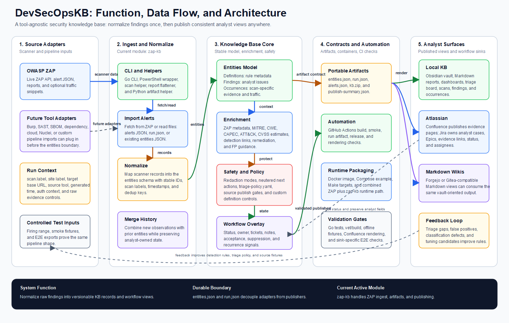

# DevSecOpsKB Architecture

Editable source: `diagrams/devsecopskb-architecture.svg`.

## What This Graphic Shows

- **Function**: DevSecOpsKB turns scanner output into a deterministic security knowledge base that analysts can publish, triage, version, and replay.
- **Data flow**: tool output is imported, normalized into the entities model, enriched, protected, packaged as run artifacts, and rendered into analyst-facing sinks.
- **Architecture boundary**: `entities.json` and `run.json` are the durable exchange contracts; source adapters and publishers can evolve independently around that model.

## Current Repo Shape

- `zap-kb/` is the active source module and owns the current ZAP ingest, normalization, enrichment, artifact, and publishing path.
- `zap-kb/internal/entities/` defines the stable model: definitions, findings, and occurrences.
- `zap-kb/internal/output/` contains the current output packages: Obsidian, Confluence, Jira, run artifacts, JSON dumps, and zip packaging.
- Future modules such as Burp, SAST, SBOM, dependency, or cloud importers should plug in before the entities boundary instead of bypassing it.
