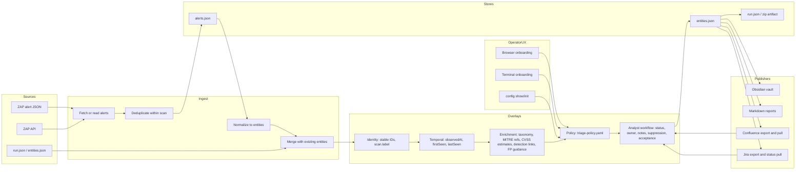

# zap-kb Architecture

`zap-kb` is the ZAP-focused module of DevSecOps KB. The stable boundary is
the entities model: ZAP alerts are normalized into definitions, findings, and
occurrences, then downstream publishers render that model into analyst-facing
systems.

## Current Capabilities

- Ingest from a live ZAP API, a flat ZAP alert file, a run artifact, or a bare
  entities file.
- Normalize ZAP data into the entities schema for deterministic diffs and
  portable artifacts.
- Preserve scan identity with `scan.label` so repeated alerts across scans
  remain distinct observations.
- Enrich definitions and findings with ZAP metadata, taxonomy fields, MITRE
  source references, estimated CVSS, detection references, false-positive
  guidance, and remediation text.
- Capture bounded request/response evidence when requested, with redaction
  controls for shared artifacts.
- Publish an Obsidian vault with indexes, dashboards, issue pages, occurrence
  pages, definition pages, scan views, and tuning candidates.
- Export/pull Confluence pages while preserving analyst-owned blocks.
- Export Jira issues and optional detection Epics, then reflect live Jira status
  and owner back into KB output.
- Generate Markdown reports and zipped run artifacts for CI handoff.
- Configure triage automation with `triage-policy.yaml`, plus terminal and web
  onboarding flows.

## Explicit Non-Goals For This Slice

Additional source adapters such as Burp, SAST, SBOM, dependency scanners, or
cloud findings should be added beside `zap-kb` or behind a shared importer
contract later. This module still treats ZAP as its first-class source.

## Remaining Architecture Work

- Extract a shared importer contract before adding non-ZAP adapters.
- Keep CLI subcommands small and independently testable as the command surface
  grows.
- Add live-service smoke workflows for deployments that can provide ZAP, Jira,
  and Confluence test credentials.
- Promote the generated Obsidian/Confluence/Jira views into a dedicated analyst
  web dashboard if the team wants an app-native workflow surface.
