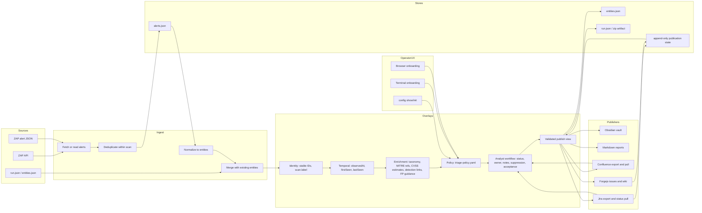

# zap-kb Architecture

`zap-kb` is the ZAP-focused module of DevSecOps KB. The stable boundary is
the entities model: ZAP alerts are normalized into definitions, findings, and
occurrences, then downstream publishers render that model into analyst-facing
systems.

```mermaid
flowchart LR
  subgraph Sources
    ZAPI["ZAP API"]
    ZFILE["ZAP alert JSON"]
    RUNIN["run.json / entities.json"]
  end

  subgraph Ingest
    FETCH["Fetch or read alerts"]
    DEDUP["Deduplicate within scan"]
    NORMALIZE["Normalize to entities"]
    MERGE["Merge with existing entities"]
  end

  subgraph Overlays
    ID["Identity: stable IDs, scan.label"]
    TIME["Temporal: observedAt, firstSeen, lastSeen"]
    ENRICH["Enrichment: taxonomy, MITRE refs, CVSS estimates, detection links, FP guidance"]
    POLICY["Policy: triage-policy.yaml"]
    ANALYST["Analyst workflow: status, owner, notes, suppression, acceptance"]
    VIEW["Validated publish view"]
  end

  subgraph Stores
    ALERTS["alerts.json"]
    ENTITIES["entities.json"]
    RUNOUT["run.json / zip artifact"]
    PUBSTATE["append-only publication state"]
  end

  subgraph Publishers
    OBS["Obsidian vault"]
    REPORT["Markdown reports"]
    CONF["Confluence export and pull"]
    JIRA["Jira export and status pull"]
    FORGEJO["Forgejo issues and wiki"]
  end

  subgraph OperatorUX
    TUI["Terminal onboarding"]
    WEB["Browser onboarding"]
    CONFIG["config show/init"]
  end

  ZAPI --> FETCH
  ZFILE --> FETCH
  RUNIN --> MERGE
  FETCH --> DEDUP --> ALERTS --> NORMALIZE --> MERGE
  MERGE --> ID --> TIME --> ENRICH --> POLICY --> ANALYST --> VIEW
  VIEW --> ENTITIES
  VIEW --> RUNOUT
  VIEW --> OBS
  VIEW --> REPORT
  VIEW --> CONF
  VIEW --> JIRA
  VIEW --> FORGEJO
  JIRA --> PUBSTATE
  FORGEJO --> PUBSTATE
  PUBSTATE --> VIEW
  CONF --> ANALYST
  JIRA --> ANALYST
  CONFIG --> POLICY
  TUI --> POLICY
  WEB --> POLICY
```

## Current Capabilities

- Ingest from a live ZAP API, a flat ZAP alert file, a run artifact, or a bare
  entities file.
- Normalize ZAP data into the entities schema for deterministic diffs and
  portable artifacts.
- Preserve scan identity with `scan.label` so repeated alerts across scans
  remain distinct observations.
- Enrich definitions and findings with ZAP metadata, taxonomy fields, MITRE
  source references, estimated CVSS, detection references, false-positive
  guidance, and remediation text.
- Capture bounded request/response evidence when requested, with redaction
  controls for shared artifacts.
- Publish an Obsidian vault with indexes, dashboards, issue pages, occurrence
  pages, definition pages, scan views, and tuning candidates.
- Export/pull Confluence pages while preserving analyst-owned blocks.
- Export Jira issues and optional detection Epics, then reflect live Jira status
  and owner back into KB output.
- Export Forgejo issues and wiki pages while retaining confirmed issue
  references in publisher-owned state rather than rewriting scanner input.
- Generate Markdown reports and zipped run artifacts for CI handoff.
- Configure triage automation with `triage-policy.yaml`, plus terminal and web
  onboarding flows.

## Explicit Non-Goals For This Slice

Additional source adapters such as Burp, SAST, SBOM, dependency scanners, or
cloud findings should be added beside `zap-kb` or behind a shared importer
contract later. This module still treats ZAP as its first-class source.

## Runtime Responsibility Map

`cmd/zap-kb/main.go` owns the process boundary: global flag parsing, the one
signal-derived cancellation context, ordered sink coordination, final artifact
completion, and the exit code. Stable runtime phases live beside it:

| Boundary | Owner | Contract |
| --- | --- | --- |
| Flag and environment precedence | `flag_resolution.go`, `atlassian_config.go` | Explicit flag, then non-blank environment, then safe default; credentials never enter diagnostics. |
| Validated input and optional ZAP fetch | `pipeline_input.go` | Accepts alert JSON, bare entities, or run wrappers; validates typed artifacts before any output or destination call. |
| Identity, merge, enrichment, policy, validation | `pipeline_entities.go` | Produces the single validated entities view consumed by renderers and publishers. Child timeouts derive from the process context. |
| Initial local representation | `pipeline_output.go` | Writes entities, flat alerts, paired JSON, or the Obsidian vault from the validated view. |
| Immutable-input enforcement and publication refs | `publication_state.go`, `internal/output/publicationstate` | Rejects input/output aliases, overlays only confirmed refs, and appends destination-isolated state. |
| Destination adapters | `jira_sync.go`, `forgejo_sync.go`, `internal/output/{jira,forgejo,confluence}` | Own transport and destination-specific reconciliation; append typed stage results instead of exiting the process. |
| Renderer views and analyst preservation | `internal/output/obsidian`, `internal/output/confluence` | Obsidian constructs deterministic Markdown views; Confluence converts those views, preserves analyst blocks, and owns page upsert/transport. |

Jira remains ordered before full Confluence export because generated evidence
pages include confirmed Jira references and read-back status. Forgejo issue
publication remains ordered before its wiki pass for the same first-publish
cross-link guarantee. That cross-sink sequencing intentionally stays in the
top-level coordinator; extracting it into independent publishers would obscure
the dependency rather than reduce it.

## Remaining Architecture Work

- Extract a shared importer contract before adding non-ZAP adapters.
- Keep CLI subcommands small and independently testable as the command surface
  grows.
- Split the large Obsidian template assembly and Confluence view conversion
  into smaller files only with golden/public-boundary output fixtures. Their
  current package boundaries are stable, but a broad move without stronger
  serialized-output coverage would be difficult to review.
- Add live-service smoke workflows for deployments that can provide ZAP, Jira,
  and Confluence test credentials.
- Promote the generated Obsidian/Confluence/Jira views into a dedicated analyst
  web dashboard if the team wants an app-native workflow surface.
