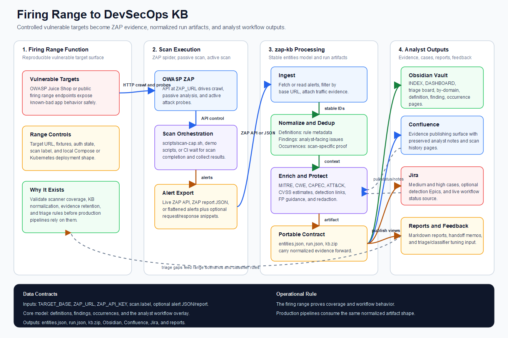

# Firing Range Architecture

Editable source: `diagrams/firing-range-architecture.svg`.

## What This Graphic Shows

- **Function**: the firing range is a controlled vulnerable target surface used to exercise ZAP coverage, produce repeatable evidence, and validate downstream triage behavior.
- **Data flow**: ZAP scans the target, emits alerts and optional traffic snippets, and `zap-kb` turns that scanner output into the stable entities model.
- **Architecture boundary**: the durable contract is `entities.json` / `run.json`; Obsidian, Confluence, Jira, reports, and handoff memos are downstream views over that model.

## Repo Touchpoints

- `scripts/demo-compose.sh` and `scripts/demo-k8s.ps1` run the local Juice Shop firing range path, call `zap-kb/scripts/scan-zap.sh`, then build `out/entities.json`, `out/run.json`, and an Obsidian vault.
- `zap-kb/scripts/zap_run_artifact.py` provides the CI-friendly artifact path from a live ZAP API or an alerts JSON file.
- `zap-kb/docs/architecture.md` documents the generic `zap-kb` model shown in the center of the graphic.
