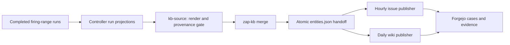

# Live publishing and large-wiki review

Date: 12 September 2026. Scope: the existing firing-range integration, scheduled Kubernetes Forgejo, and separate Docker demo Forgejo. This review followed the reliability goals document and the owner's clarification that Forgejo serves the self-hosted demonstration while Jira/Confluence is an intended workplace DAST destination.

**Conclusion**

Keep Forgejo as the self-hosted sink. The source handoff and issue publication infrastructure already exist and have successful current Job outcomes. The main demonstrated obstacle is the cost and reliability of the wiki REST publication path. It is not necessary to build a new scanner adapter or replace the sink to begin addressing that obstacle.

The live review found a 2,047-file scheduled wiki with 11,791 commits, a default-size listing that exceeded a 20-second observation budget, and an expensive but functioning 1,346-page demo wiki. Current publisher code also performs substantial unchanged-run work. Address server support, deployed revision visibility, and the publication algorithm before increasing deadlines again.

**Existing integration**

The companion checkout is `F:\projects\devsecopsfiringranve`. Its existing integration is:



The source runs at minute 30, the issue publisher hourly at minute 0, and the wiki publisher at 03:15 according to their CronJob expressions. No time zone is explicitly asserted here. The source lives inside `devsecops-kb`, reads controller-api, stages admissible native-tool reports, delegates merge semantics to the KB, and atomically replaces `/ingest/entities.json`. It advances its watermark after the handoff. The provenance policy is `native-tool-only-v1`; broadening that policy is separate work.

The Docker Compose instance remains an operator/demo path. The Kubernetes instance is the scheduled sink. These are different repositories and datasets, so their timings cannot be treated as before/after measurements of the same system.

Source touchpoints: `workers/publisher-worker/internal/kbsource/kbsource.go`, `infra/k8s/kb-sink/kb-source/cronjob.yaml`, `infra/k8s/kb-sink/local/kb-publisher-issues-only.yaml`, and `infra/k8s/kb-sink/local/kb-publisher-wiki.yaml` in the companion repository. No companion-repository files were edited.

**Fresh observations**

The local runtimes were initially stopped. After the owner started Docker, both the container and `k3s-local` became reachable. Measurements below were taken shortly after startup, so cold-cache effects are possible. Requests were sequential and bounded; they are samples, not p95 service-level measurements.

| Observation | Scheduled Kubernetes sink | Docker operator/demo sink |
|---|---|---|
| Repository | `devsecops/kb` | `kbadmin/kb-demo` |
| Reported server version | `9.0.3+gitea-1.22.0` | Same |
| Wiki size | 2,047 tracked files, counted through Git | 1,346 pages, API count header |
| Wiki history | 11,791 commits | Not measured |
| Health | 31 ms initially, 17 ms afterward | 17 ms initially, 15 ms afterward |
| Issue-list sample, one result | 29 ms | 34 ms |
| Wiki-list request with `limit=1` | Client timeout at 20.013 s | 7.750 s, 30 results |
| Wiki-list request with `limit=50` | Not attempted after the timeout | 15.671 s, 50 results |
| Focused wiki-list request with `limit=2` | 2.968 s, 2 results | Not needed |
| Single-page sample | Home: 4.243 s, 478,119-byte API response | Three sampled pages: 0.988, 0.624, 0.640 s |

On this server, `limit <= 1` selects the default page size, rather than requesting one page. The demo response returned 30 entries. The scheduled timeout therefore concerns a default-size listing. The follow-up used `limit=2` to obtain a genuinely smaller response.

The server logged `GetCommit: signal: killed` and HTTP 500 around the timed-out scheduled listing. Because the diagnostic client canceled at its observation deadline, this does not establish an independent server OOM or timeout: the killed Git process can be associated with request cancellation. The narrower two-entry request and Home read succeeded.

The scheduled wiki's basic Git metadata operations were quick: commit count in 0.280 s, file listing in 0.199 s, and object statistics in 0.205 s, each including the Kubernetes exec overhead. Object statistics showed 7,814 loose objects occupying about 177 MiB, plus four packs totaling about 10.6 MiB. Those figures suggest repository maintenance is worth testing on a disposable copy; they do not by themselves establish corruption or justify modifying production Git history.

The Kubernetes Forgejo resource limit is 3 CPUs/1 GiB. One sampled metric was 272 millicores and 382 MiB. The container had 13 restarts over its lifetime, with its last recorded termination marked Completed, exit 0. These observations do not prove sustained resource saturation. The demo container has no explicit CPU/memory cap; its early idle sample was about 126 MiB.

**Publication state and revision visibility**

The issue CronJob recorded a successful completion at `2026-09-12T23:44:39Z`, after an initial failed pod during startup. Its successful pod reported:

```text
Forgejo: created=0 reopened=0 updated=0 skipped=6 errors=0 duplicates_closed=0
Forgejo pull: fetched=345 notfound=0 errors=0 (KB status write-back disabled)
```

The source CronJob recorded success at `2026-09-12T23:45:01Z`. A successful source Job does not prove that this tick contained new findings; a fresh scan-to-publication canary was not run. The pull counter is publisher accounting, not a count of distinct remote issues.

The wiki CronJob has no recorded `lastSuccessfulTime` in its current status. Retained Jobs include failed attempts; this supports a current reliability concern but is not proof that no historical manual publish ever succeeded. The live configuration is a 45-minute wiki pass, 90-second request timeout, one retry, and a 5,700-second outer Job deadline.

Both publishers use `devsecopslab/zap-kb:wikireqto-20260809`, with observed image digest `sha256:fadb69d5caeb7dd6884ae756872f2afb7a93e7c0df703bf92b3143e7d6f2b17d`. This tag identifies the earlier lab build, not a verified current-main revision. Current-main validation must not be presented as validation of that deployed binary. Record build revision and image digest explicitly and deploy a reviewed build through a controlled release.

Both servers run the discontinued 9.x line. Forgejo currently lists 15.x as its LTS line and 16.x as stable. Move to a supported version through the documented upgrade path, with backup/restore and compatibility checks. This review did not upgrade either instance. [Forgejo release and support status](https://forgejo.org/releases/)

**Why the wiki is expensive**

The v9.0.3 server's `ListWikiPages` lists Git tree entries, then invokes `GetCommitByPath` for each selected file. That helper executes `git log -1` for the path. The endpoint therefore retrieves per-page history metadata; it is not a cheap list of page names. Pagination limits the number of these lookups per request but does not eliminate them from a complete traversal. Single-page reads also fetch last-commit metadata. This mechanism is consistent with slow REST listings while basic Git tree reads remain fast. [Forgejo v9 wiki handler](https://codeberg.org/forgejo/forgejo/src/tag/v9.0.3/routers/api/v1/repo/wiki.go), [Git history lookup](https://codeberg.org/forgejo/forgejo/src/tag/v9.0.3/modules/git/repo_commit.go)

I also inspected the v15.0.8 handler. It still calls `GetCommitByPath` for each selected entry. Other changes may affect throughput, but an upgrade alone is not demonstrated to remove this cost. [Forgejo v15 wiki handler](https://codeberg.org/forgejo/forgejo/src/tag/v15.0.8/routers/api/v1/repo/wiki.go)

Current DevSecOpsKB adds its own work in `internal/output/forgejo/wiki.go`: a complete listing before publication, one remote-content read for each existing page, then another complete listing for link repair. Its default shared request spacing is 250 ms. The current throttle releases its mutex before network I/O, so older companion notes claiming all network requests remain serialized under that mutex are stale.

For an unchanged wiki with N pages and 50-entry listing batches, the approximate request count is `1 + N + 2 * (ceil(N/50) + 1)`: repository preflight, page reads, two listings, and their termination requests. That is about 2,132 requests for 2,047 pages. The request-spacing floor alone is about 8 minutes 53 seconds, before additional service costs; it is an analytical floor, not a measured complete-pass duration. Slow per-page history and listing responses can dominate that floor.

The first listing happens before any upsert. Making only link repair optional would leave this failure point intact and may degrade navigation. Reducing the batch size can help an individual request fit its deadline, but it creates more requests and should be evaluated as a bounded workaround. Increasing worker concurrency also cannot bypass sequential listing or the global request-start rate.

**Historical throughput, clearly separated from today's measurements**

The companion's retained August 9 measurement describes 810 upserts in 45 minutes with 722 errors, before link repair. A retained live Job log from `wiki-90s-measure` reports `created=6 updated=466 skipped=2 link_fixes=0 errors=905`. Thus the shorter 90-second request setting did not produce a successful large-wiki pass in that retained attempt.

The saved `exports/wiki-throughput-90s.csv` covers roughly 23 minutes on August 9 with a constant 4,430 commits and 1,972 files. That counter observes mutations only: it cannot distinguish a stalled publisher from successful reads or no-op comparisons. It is insufficient to establish throughput or prove a fix. Current stage timing and request counts are needed.

Older companion documents say the timeout flags were uncommitted. They are present in current DevSecOpsKB main, including the August 30 cancellation fix. Those historical instructions should not drive a new deployment without checking the current repository and image.

**Ranked next work**

1. Complete the shared reliability goals, preserving the useful hourly-issues/daily-wiki separation. Add stage duration, request counts, retries, and a common sanitized result so a wiki failure cannot look like unexplained silence.
2. Establish revision-aware deployment and test a supported Forgejo release on a disposable copy or synthetic equivalent. Compare server version, publisher revision, cold/warm behavior, and storage while holding the dataset constant. Do not attribute an improvement to an upgrade when the dataset also changed.
3. Reduce full traversals: reuse known server-issued paths and avoid the second listing when no new pages require link remapping, with explicit handling for concurrent changes. Evaluate durable content/path manifests with invalidation. Preserve correctness when remote state differs.
4. Prototype batch Git-based wiki publication as an alternative backend on a disposable repository. It could turn many API writes into one commit and bypass expensive list metadata. Its acceptance must cover Forgejo filename/link encoding, correct wiki branch, preservation of non-KB pages, no-op commits, conflict recovery, bounded credentials, and failed pushes. This is a proposal, not an implemented or validated solution.
5. Test repository housekeeping on a copy and compare; never prune, rewrite history, or run aggressive maintenance against the existing sink as part of a performance experiment. Measure representative 100/1,000/5,000-page fresh, unchanged, and changed runs before choosing runtime targets.
6. Make the demonstration landing page concise, linking to rule and scan views rather than requiring the full evidence corpus on entry. Before external hosting, configure the intended external URL and HTTPS/access policy; the current in-cluster URL is an internal service address. Retain full intended evidence in drill-down pages and portable artifacts.

There is also a handoff concern to test during maintainability work: the source atomically replaces the ingest file, while the issue publisher can persist ticket references into that same file. Atomic replacement prevents partial files but does not provide mutual exclusion or compare-and-swap. The schedules reduce ordinary overlap without guaranteeing it after startup delays or long runs. Separate immutable input batches from mutable publication state, or introduce explicit version checks. No data-loss event was established in this review.

**Workplace adoption**

Keep Jira/Confluence as a first-class destination for existing workplace DAST scans. The workplace need not deploy the firing range. Start with the same portable normalized artifact, a designated test project/space, verified issue fields and permissions, evidence redaction, Jira-owned workflow, preserved Confluence analyst blocks, and a repeat-publish acceptance case. The owner has no personal Atlassian tenant, so live Cloud validation remains pending external test access; local contract tests must be reported accurately.

**What this review establishes**

It establishes live reachability, useful current issue publication, existing source integration, real wiki-read latency, repository size/history, retained failures, and a source-grounded explanation of expensive operations. It does not establish complete write throughput, a safe upgrade result, or a new scan's end-to-end arrival. No publish, scan, upgrade, pruning, workflow writeback, or shared-input replacement was triggered. Scheduled Jobs resumed independently when the owner started the lab. Temporary loopback port-forwards were closed and verified closed; credentials and evidence bodies were not retained in the diagnostic reports.

Sanitized local evidence is under `out/evaluation-2026-09-12/`: `live-readonly-results.json`, `live-focused-results.json`, `live-job-results.json`, `live-success-results.json`, and `live-server-errors.json`. Reproduction probes used only GETs plus bounded read-only Kubernetes/Git inspection.
